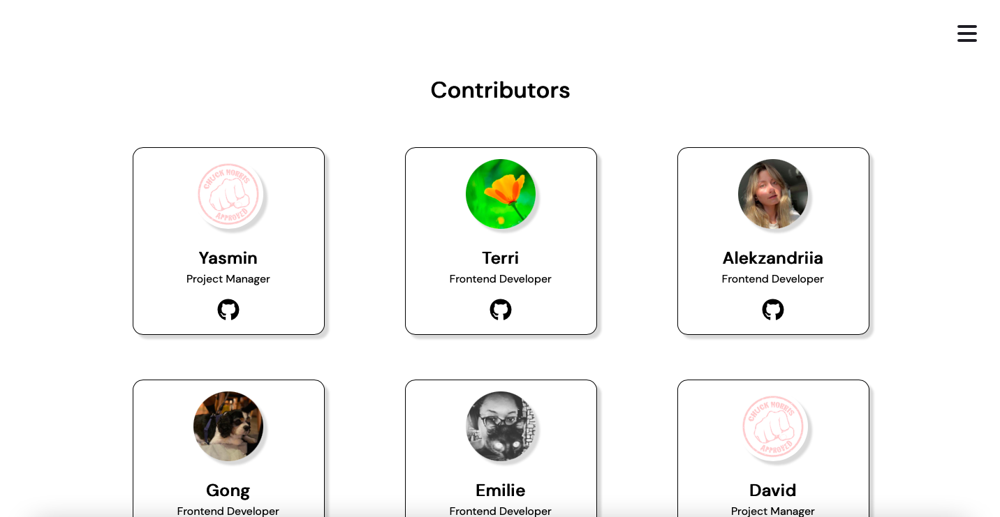

# Facts of Fury

### A Chingu Collaborative Project

Chingu - Brings together remote teams of learning developers to experience collaborating on a software project using modern communication tools, replicating the process used at the companies we hope to be hired at.

During a Chingu Voyage, the team designs, plans, develops, codes, and deploys a complete software project in six weeks.  From communication on Discord, creation of a wireframe on Figma, task-tracking on Jira, and code sharing on GitHub ...

The Tier One requirements for Chingu Voyage 42 are found at https://github.com/chingu-voyages/voyage-project-tier1-norris.  Build a web-based application that retrieves Chuck Norris facts from the Chuck Norris API project.  

Our app meets the following requirements:
* Display a random Chuck Norris fact upon loading
* Present user with a list of categories from which to choose a random fact
* Exclude the "explicit", "religious", and "political" categories 
* Include a footer on the "Team" page that includes a link to our github repository
* Include a READme file

Other features include:
* Animation to increase user engagement
* A Team page to introduce all collaborators including links to social media
* Responsiveness - layouts created for mobile screens through desktop monitors
* Two navigation systems.  The first is the natural progression of clicking through the landing page to a category page with a list of possible choices or the ability to let Chuck choose by clicking on him.  The third page displays the fact and allows the possibility of showing a new fact or moving back to the category page.  The second navigation system is a menu bar hidden by a hamburger menu with icons for the home page and a teams page.
* The ability to share to Twitter or Facebook

# Screenshots

## Landing Page
Top of page

Bottom of page

Page with What is This? information showing

## Category Page

## Fact Page

## Hamburger Menu Navigation
Closed Hamburger Menu

Home icon, Team icon, and Close Button

Clicking on Team icon takes user to the Contributors Page

## Contributors Page
